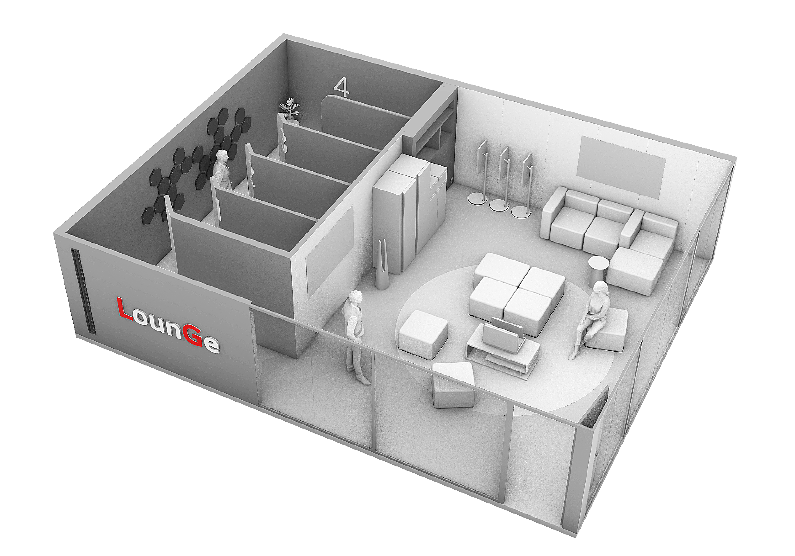

[](https://classroom.github.com/online_ide?assignment_repo_id=10031186&assignment_repo_type=AssignmentRepo)

# LounGe

<div align=center>
  
  ### Front
  
  
  
  
  
  ### Back
  
  
  
  ### 협업 툴 
  
  
</div>




<br/><br/>

## 목차

1. [🤖 프로젝트 소개](#-프로젝트-소개)

2. [💻 주요 기능](#-주요-기능)

3. [🎥 소개 영상](#-데모-영상)

4. [💁🏻 팀원 소개](#-팀원-소개)

5. [🎨 프로젝트 구조](#-프로젝트-구조)

6. [🔨 작업 방식](#-작업-방식)

7. [✨ 기대 효과](#-기대-효과)

8. [🔑 관련 문서](#-관련-문서)


<br/><br/>

## 🤖 프로젝트 소개


<code>LG전자의 미래 고객인 대학생을 대상으로 한 교내 라운지 서비스를 원활하게 운영하기 위해 웹페이지 구현</code>
<br/>
프로젝트기간
2024년 9월 2일 ~ 9월 12일


<br/><br/>

## 💻 주요 기능
<div>
  
  
</div>

 <code>‘LounGe’ 공간에 배치된 제품 예약 </code>
 <br/>

 asdf
 <br/>
 <br/>

 <code>asdf</code>
 <br/>

  asdf 
 <br/>
 <br/>


 <code>asdf </code>
 <br/>

 asdf

<br/><br/>

## 🎥 소개 영상
[](https://youtu.be/xVOopTkpRfs)

<br/><br/>

## 💁🏻 팀원 소개
```
김나린 : Frontend 개발자 🥰
```
```
이상현 : 3D 디자이너 😎
```
```
이지민 : Web 디자이너 😝
```
```
이하연 : Backend 개발자 😳
```
```
임정현 : Frontend 개발자 😏
```
```
조현아 : Backend 개발자 🤓
```


<br/><br/>

## 🎨 프로젝트 구조 


<code> 프로젝트 흐름도 </code>  


<br/>


<code> 시스템 구조도 </code>  


<br/><br/>

## 🔨 작업 방식
github의 issue와 pull request기능을 활용해 프로젝트 작업 진행 

<br/>


<br/><br/>

## ✨ 기대 효과

<code>ㅇ </code>
 <br/>
 
ㅇ
<br/>
<br/>

<code>ㅇ</code>
 <br/>
 
ㅇ
<br/>
<br/>

<code>축ㅇㅇ다. </code>
 <br/>
 
ㅇ
<br/>
<br/>

<code>ㅇ</code>
 <br/>
 
ㅇ


<br/><br/>

## 🔑 관련 문서

### [중간 발표 자료](docs/ㅇㅇ.pdf)
